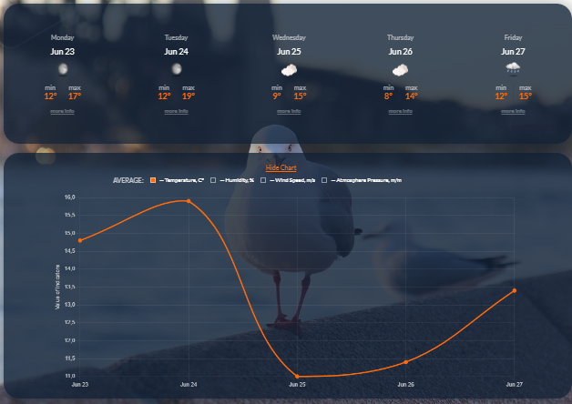

# Weather App

A web application that provides current weather information, a 5-day forecast,
and an hourly forecast for selected cities. Users can search for cities, save
their favorite locations, and enjoy dynamic background images and inspirational
quotes.

## Features

*   **Current Weather Display:** Shows real-time weather conditions including temperature, perceived temperature, weather description (e.g., cloudy, sunny), wind speed, humidity, and atmospheric pressure.
*   **5-Day Weather Forecast:** Provides a forecast for the next five days, including daily high/low temperatures and weather conditions.
*   **Hourly Forecast:** Offers a detailed hourly forecast for a selected day from the 5-day view, showing temperature and conditions for each hour.
*   **City Search & Favorites:** Allows users to search for any city worldwide and add/remove cities from a personalized list of favorites, which are saved locally.
*   **Dynamic Backgrounds:** The application background changes dynamically based on the current city and weather conditions, powered by the Pixabay API.
*   **Inspirational Quotes:** Displays a new inspirational quote periodically to brighten your day.
*   **Responsive Design:** The application is designed to be responsive and work well on various screen sizes, from mobile devices to desktops.
*   **Real-time Clock:** Displays the current time, updating every second.
*   **Sunrise & Sunset Times:** Shows the local sunrise and sunset times for the selected city.
*   **Interactive 5-Day Averages Chart:** Displays a visual chart of 5-day averages for key weather metrics. By default, it shows average temperature. Users can select to view average pressure, precipitation, or wind speed on the chart.
    

## How it Works

The Weather App fetches data from several APIs to provide a comprehensive
experience:

1.  **User Interaction:** The user searches for a city or selects one from their
    saved favorites.
2.  **Weather Data:** The application calls the **OpenWeatherMap API** to get
    current weather conditions, as well as 5-day and hourly forecasts for the
    selected city.
3.  **Background Imagery:** Based on the selected city (and potentially weather
    conditions), the app fetches relevant background images from the **Pixabay
    API** to provide a visually appealing interface.
4.  **Inspirational Quotes:** The app periodically fetches and displays
    inspirational quotes using the **Forismatic API** (or a similar public quote
    API).
5.  **Display:** The retrieved data is then processed and rendered dynamically
    on the page, updating the UI to reflect the latest weather information,
    background, and quote.


## Technologies Used

*   **Frontend:** HTML5, CSS3, JavaScript (ES6+)
*   **Build Tool:** Vite
*   **APIs:**
    *   OpenWeatherMap API (for weather data)
    *   Pixabay API (for background images)
    *   Forismatic API (for quotes)
*   **Libraries:**
    *   iziToast (for notifications)
    *   Chart.js (for data visualization)
*   **Version Control:** Git & GitHub
*   **Deployment:** GitHub Pages

## Setup and Usage

To get a local copy up and running, follow these simple steps:

1.  **Clone the repository:**

    ```bash
    git clone https://github.com/your-username/weather-app.git
    cd weather-app
    ```

    _(Replace `your-username` with the actual GitHub username or organization if
    known, otherwise, a placeholder is fine for now and can be updated in
    review.)_

2.  **Install NPM dependencies:** This project uses NPM to manage dependencies.

    ```bash
    npm install
    ```

3.  **Run the development server:** This command will start the Vite development
    server and open the application in your default browser. It also enables
    hot-reloading.

    ```bash
    npm run dev
    ```

4.  **Build for production:** To create a production build in the `dist` folder:

    ```bash
    npm run build
    ```

5.  **Preview the production build:** To serve the `dist` folder locally for
    previewing the production version:
    ```bash
    npm run preview
    ```

## Deployment

This project is configured for easy deployment to GitHub Pages.

- **Deploy Command:**

  ```bash
  npm run deploy
  ```

  This script uses `gh-pages` to build the application and push the contents of
  the `dist` folder to the `gh-pages` branch of your repository, making it live.

*   **Deployment Status:**
    [](https://stanislavnemch.github.io/weather-app/)


## Configuration

The application uses API keys for OpenWeatherMap and Pixabay to fetch weather
data and background images, respectively.

- **OpenWeatherMap API Key:** Pre-configured in `src/js/openweathermap-api.js`.
- **Pixabay API Key:** Pre-configured in `src/js/pixabay-api.js`.
- **Forismatic API:** Used for quotes and accessed via a CORS proxy; no separate
  API key is required for client-side setup.

The pre-configured keys are likely from free tiers and may have usage
limitations. If you plan to deploy this application for wider use or encounter
API rate limits, you should obtain your own API keys from
[OpenWeatherMap](https://openweathermap.org/appid) and
[Pixabay](https://pixabay.com/api/docs/) and update them in the respective
JavaScript files.

## Author

- **Stanislav Nemchenko**
  - GitHub: `[@stasbuka](https://github.com/stasbuka)`
  - Email: `stas.buka@gmail.com`

## License

This project is licensed under the ISC License.
